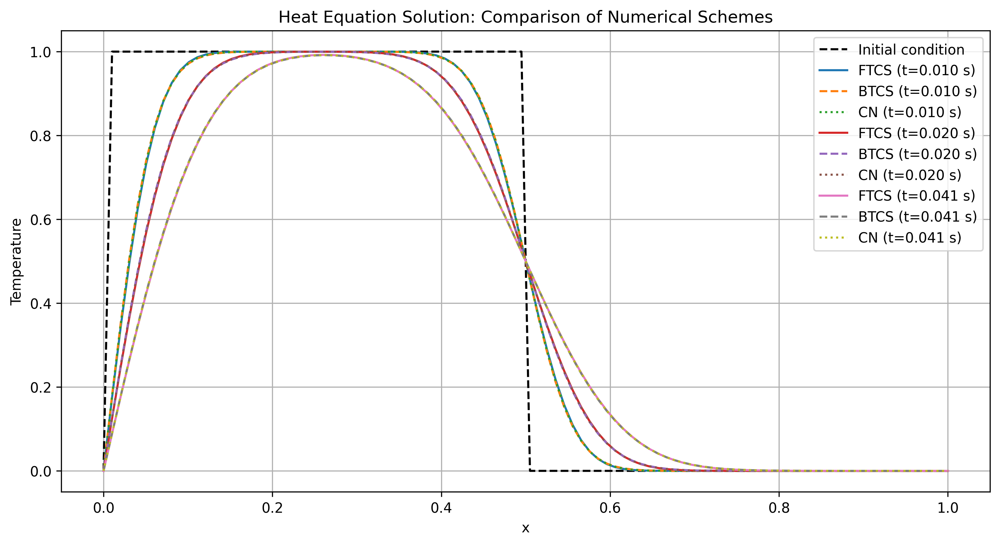

# Heat Equation Solver

This package provides a finite difference solver for the one-dimensional heat equation.

## Mathematical Background

The one-dimensional heat equation is given by:

```math
\frac{\partial u}{\partial t} = \alpha \frac{\partial^2 u}{\partial x^2}
```

where:
- u(x,t) is the temperature at position x and time t
- α is the thermal diffusivity coefficient

### Implemented Numerical Schemes

1. **Forward-Time Central-Space (FTCS) - Explicit Scheme**
   ```math
   u_i^{n+1} = u_i^n + \frac{\alpha \Delta t}{\Delta x^2}(u_{i+1}^n - 2u_i^n + u_{i-1}^n)
   ```
   - Explicit scheme
   - Conditionally stable: r = α∆t/∆x² ≤ 0.5 (CFL condition)
   - Simple to implement but requires smaller time steps

2. **Backward-Time Central-Space (BTCS) - Implicit Scheme**
   ```math
   -ru_{i-1}^{n+1} + (1+2r)u_i^{n+1} - ru_{i+1}^{n+1} = u_i^n
   ```
   where r = α∆t/∆x²
   - Implicit scheme
   - Unconditionally stable
   - Requires solving a linear system at each time step

3. **Crank-Nicolson (CN) - Implicit Scheme**
   ```math
   -\frac{r}{2}u_{i-1}^{n+1} + (1+r)u_i^{n+1} - \frac{r}{2}u_{i+1}^{n+1} = 
   \frac{r}{2}u_{i-1}^n + (1-r)u_i^n + \frac{r}{2}u_{i+1}^n
   ```
   - Implicit scheme
   - Unconditionally stable
   - Second-order accurate in time
   - Requires solving a linear system at each time step

## Example: Heat Diffusion with Step Initial Condition



The above visualization demonstrates the solution of the heat equation with:

### Initial Condition (black dashed line):
- Step function: Temperature = 1.0 for x < 0.5, and 0.0 for x ≥ 0.5
- Creates a sharp temperature discontinuity at x = 0.5

### Boundary Conditions:
- Left boundary (x = 0): Fixed at T = 1.0 (matching left side of step)
- Right boundary (x = 1): Fixed at T = 0.0 (matching right side of step)

### Evolution Over Time:
The plot shows the temperature distribution at three different times:
- t = 0.010s (early stage): Initial smoothing of the discontinuity
- t = 0.020s (intermediate): Further diffusion of heat
- t = 0.041s (later stage): Approaching steady state

### Numerical Schemes Comparison:
All three schemes (FTCS, BTCS, and CN) are shown at each time:
- FTCS: Solid lines
- BTCS: Dashed lines
- CN: Dotted lines

The visualization demonstrates key physical phenomena:
1. Heat diffusion smooths out the sharp temperature gradient
2. The solution maintains the boundary values at the ends
3. All three numerical schemes produce very similar results
4. The system gradually approaches a smooth, steady-state profile

## Installation

```bash
pip install .
```

For development installation with additional tools:
```bash
pip install -e ".[dev]"
```

## Usage

```python
from heat_solver import HeatEquationSolver, SchemeType
import numpy as np

# Define problem parameters
alpha = 0.1  # Thermal diffusivity
L = 1.0      # Domain length
nx = 100     # Number of spatial points
nt = 100     # Number of time steps
dt = 0.01    # Time step size

# Define boundary conditions (optional, defaults to zero)
def bc_left(t): return 1.0   # Fixed temperature at left end
def bc_right(t): return 0.0  # Fixed temperature at right end

# Create solver
solver = HeatEquationSolver(
    alpha=alpha,
    length=L,
    nx=nx,
    nt=nt,
    dt=dt,
    scheme=SchemeType.CN,  # Using Crank-Nicolson scheme
    bc_left=bc_left,      # Optional
    bc_right=bc_right     # Optional
)

# Define initial condition (step function)
def initial_condition(x):
    return np.where(x < 0.5, 1.0, 0.0)

# Solve
t, u = solver.solve(initial_condition)
```

## Features

- Three numerical schemes: FTCS (explicit), BTCS (implicit), and Crank-Nicolson
- Configurable boundary conditions
- Automatic stability checking for explicit scheme
- Pure Python implementation with NumPy
- Comprehensive documentation and tests

## Future Extensions

- 2D and 3D problem support
- Additional numerical schemes (ADI for higher dimensions)
- Variable coefficients
- Adaptive time stepping
- Source terms
- More boundary condition types
